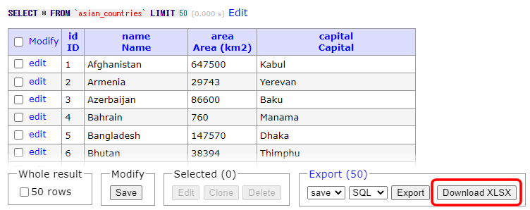

日本語の説明は下にあります。（Japanese explanation is the below.）

# Adminer Plugin - Dump to XLSX

Adminer plugin to download selected result into XLSX.

It is available in the pages of default results and SQL results.  
If multileple selected results are displayed, they are packed in the single file and each result is saved in sheet.

## How to intall plugin

1. Install Adminer PHP plugin.
2. Place `dumpxlsx.js` in the same level of directory that Adminer root programe. (ex. `adminer.php` or `index.php`)
3. You can change paths to Sheet JS, FileSaver.js and dumpxlsx.js with arguments of constructor of plugin class.

# Adminerプラグイン - XLSXダウンロード

SELECT結果をXLSXにダウンロードするAdminerプラグインです。

デフォルトの結果ページ、SQLの結果ページで利用可能です。  
複数のSELECT結果がある場合は、それぞれシートに分けて1つのファイルにまとめます。

## インストール方法

1. PHPファイルのプラグインをインストールしてください。
2. `dumpxlsx.js`をAdminerが動いているディレクトリと同じ場所に設置してください。 (ex. `adminer.php` or `index.php`)
3. プラグインクラスのコンストラクタの引数でJSファイルのパスを変更することができます。
